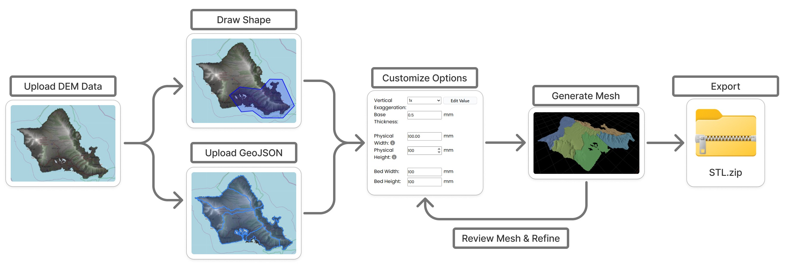

# DEM-Cropper

DEM Cropper is an open-source, browser-based application for generating 3D-printable terrain models from Digital Elevation Models (DEMs). Users can upload GeoTIFF datasets, define regions of interest, generate terrain meshes, preview the results in 3D, and export STL files for 3D printing.

<p align="center">
  
</p>

## Features
- Upload custom GeoTIFF Digital Elevation Models
- Region selection
    - Rectangle
    - Polygon
    - Circle
    - Imported GeoJSON boundaries
- Generate interactive 3D terrain meshes directly in the browser
- Adjustable vertical exaggeration and base thickness
- Specify physical model dimensions
- Automatic terrain partitioning for printer build-volume constraints
- Export STL files
- Fully browser-based, no GIS software required

## Demo

Live demo is located at loellelam.github.io/DEM-Cropper/.

## Getting Started

### Prerequisites

Before running the project, ensure the following software is installed:
* npm
* Python 3.11.3

### Installation

1. Clone the repo
    ```sh
    git clone https://github.com/loellelam/DEM-Cropper.git
    ```
2. Navigate to the project directory:
    ```sh
    cd DEM-Cropper
    ```
3. Install frontend dependencies:
    ```sh
    npm install
    ```
4. Install backend dependencies:
    ```sh
    cd server
    pip install -r requirements.txt
    cd ..
    ```

### Running the Application

1. Start the frontend server from the project root directory:
    ```sh
    npx vite
    ```
2. Open a new terminal and start the backend server:
    ```sh
    cd server
    venv/Scripts/activate # For Windows
    python server.py
    ```
3. Once both servers are running, open the frontend in your web browser (typically at http://localhost:5173).
    